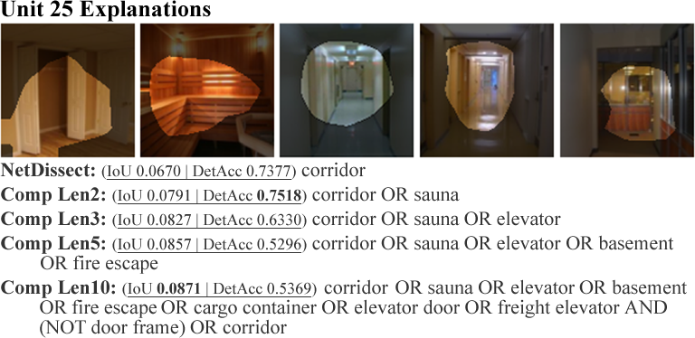
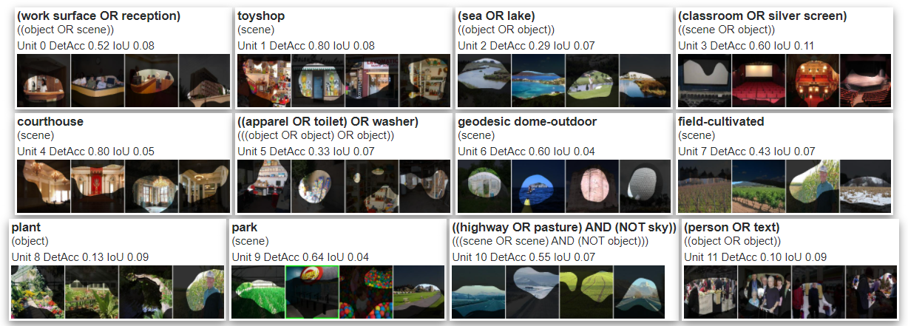

# Detection Accuracy for Evaluating Compositional Explanations of Units

Official repository of the paper "Detection Accuracy for Evaluating Compositional Explanations of Units. *Sayo M. Makinwa, Biagio La Rosa, and Roberto Capobianco1.*". Find paper at: https://arxiv.org/abs/2109.07804.

The repository contains the the code to replicate paper results.

## Description
Given some concept-based explanations of a unit of a CNN, the Detection Accuracy is an evaluation metric that scores the explanations based on how consistently the unit detect them. This work uses Detection Accuracy to determine the appropriate 'unit-optimal' lengths of compositional explanations for the units of the CNN being probed, thus removing the need to set and tune anexplanation length hyper-parameter.

The code is built to generate NetDissect explanations, Compositional explanations (of length 3), and Compositional explanations whose lengths are determined using Detection Accuracy.

## How to run

### Requirements
The code in this repo was tested on on python 3.9.2. The following packages are required:

- `pyeda`
- `torch==1.4.0`
- `torchvision==0.4.2`
- `pandas==0.25.3`
- `tqdm==4.30.0`
- `imageio==2.6.1`
- `scipy==1.4.1`
- `matplotlib==3.1.3`
- `Pillow==7.0.0`
- `seaborn==0.9.0`
- `scikit-image==0.16.2`
- `pyparsing==2.4.6`
- `pyeda==0.28.0`
- `pycocotools==2.0` Custom fork from [github.com/jayelm/cocoapi](github.com/jayelm/cocoapi)

### Instructions
1. Download Broden dataset by running the script `./script/dlbroden.sh` (only alexnet model requires downloading the 227 dataset)
2. Check the settings in `settings.py` and make sure they suite your desire.
3. You do not need to manually download the models; the code checks if the model to be probed as set in `settings.py` is available and automatically downloads it if not.
4. Run `python probe.py`. Results are generated in `result/` folder.

### Settings
All settings are in the `settings.py` file and are well commented. Here are the most important ones:

- `MODEL`: the model to probe (currently supports `resnet18`, `alexnet`, `resnet50`, `densenet161`).
- `DATASET`: the dataset the model is trained on. We used `places365` in this work and it requires models downloaded via `script/dl*.sh` scripts.
- `UNIT_RANGE`: the units to probe. To brobe all the units, set to `None`, otherwise, specify a list or range of a subset of units (, e.g. `range(10)`, or `[5, 6, 22, ...]`).
- `CONCEPT_MIN_OCCURENCE`: the minimum number of times concepts must occur in the dataset to be considered statistically relevant, i.e., included in the explanations search. Default value is `5`.
- `BEAM_SEARCH_LIMIT`: the number of candidates to be considered at each step of beam search. The actual size (number) of the concepts are 1k+ (added to each of the existing formulas at each step of beam search), however, this will drastically slow down the search. A smaller size (e.g. `50` or `100`) will run significantly faster, while giving good results.
- `BEAM_SIZE`: the size of the beam during beam search. This is the number of formulas that are kept to be combined with concepts at each step of the search to create new candidates. 
- `COMP_MAX_FORMULA_LENGTH`: the maximum formula length for the fixed length compositional explanations (default is 3).
- `FEATURE_NAMES`: the name of the layer of the model to probe. This is a model-specific parameter. In this work, we probed the last layer of the model, which can be `layer4` or `features`, depending on the model. The value is set in the conditional logic at the end of the `settings.py` file.

### Results
All results are recorded in the `result/` folder. An additional folder is further created in this directory with the name structure `{model}_{probe_dataset}_neuron_{COMP_MAX_FORMULA_LENGTH}`. The output files are saved in this subfolder and are described below:

- `tally_{layername}.csv`: records and compares the explanations (the unit-optimal explanations from this work, NetDissect, and fixed length compositional explanations), and the scores generated for the units set in `settings.py`.
- `preds.csv`: records the predictions, the target labels, and the unit activations (boolean `1` or `0`) for the images in the dataset.
- `correlation_scores.csv`: contains the scores of the correlation between the model accuracies and the evaluation scores.
- `html/{layername}.html`: contains the html visualization of the activation of units of the layer probed (last layer), the unit-optimal explanations generated, their evaluations, and summaries. Below are some sample outputs:

## Reference
This repo extends the implementation of compositional explanations (vision experiments) at: [github.com/jayelm/compexp/tree/master/vision](github.com/jayelm/compexp/tree/master/vision). Detection Accuracy is coded as the static function `compute_detacc` in `dissection/neuron.py`. The following are the main files modified from the original repo:

- `correlation.py` (new file)
- `dissection/neuron.py`
- `probe.py`
- `visualize/bargraph.py`
- `visualize/report.py`
- `loader/data_loader/formula.py`

## Citation
Please cite our paper as:
"""tex
@article{Makinwa2021,
  title={Detection Accuracy for Evaluating Compositional Explanations of Units},
  author={Sayo M. Makinwa and Biagio La Rosa and Roberto Capobianco},
  journal={ArXiv},
  year={2021},
  volume={abs/2109.07804}
}
"""

